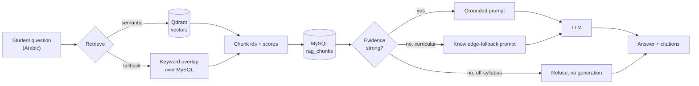

# DeepBac backend

The platform's two model-backed services: curriculum-grounded question answering, and the LSTM
knowledge tracer that steers it.

One service answers what a student asks, from the lessons the platform actually publishes, citing
which lesson each answer came from. The other estimates what the student knows, decides which
section they should revise, and conditions the first service's answers on that estimate.

| Service | Runtime | Entry point | Answers |
|---|---|---|---|
| **RAG** | Node.js | `src/server.js`, port 5001 | "What does the lesson say about X?" |
| **DKT** | Python | `dkt/api.py`, port 5002 | "Which section should this student revise, and how well do they know it?" |

They share a database, a JWT secret, and one key — `course_parts.id`, the authored lesson section.
That key is the integration: the tracer's micro-skill and the retriever's unit of retrieval are the
same row, so a weakness prediction names something retrievable and a citation names something
traceable. Neither service calls the other; a client composes them, which is what keeps either one
useful while the other is down.

Within the RAG service, three stores do three jobs, and the separation is the central design
decision:

| Component | Role |
|---|---|
| **MySQL** | System of record. Holds the curriculum and the derived text corpus. |
| **Qdrant** | Dense retrieval index. Holds vectors and pointers, never authoritative text. |
| **LLM** (OpenAI-compatible) | Generation only. Never consulted about what the curriculum says. |

## Documentation

| Document | What it covers |
|---|---|
| [docs/ARCHITECTURE.md](docs/ARCHITECTURE.md) | How the platform works: components, request lifecycle, the two services, failure behaviour, deployment. |
| [docs/RAG_PIPELINE.md](docs/RAG_PIPELINE.md) | Indexing, chunking, embeddings, retrieval, the three answer modes, prompt design, mastery steering. |
| [docs/DATA_MODEL.md](docs/DATA_MODEL.md) | MySQL schema, Qdrant collection and payload, how the two stores stay consistent. |
| [docs/API.md](docs/API.md) | Endpoint reference, and how a client composes the two services. |
| [docs/DKT_ARCHITECTURE.md](docs/DKT_ARCHITECTURE.md) | Where the tracer sits, request lifecycle, retraining. |
| [docs/DKT_MODEL.md](docs/DKT_MODEL.md) | Inputs, architecture, loss, and the details that silently break it. |
| [docs/DKT_EVALUATION.md](docs/DKT_EVALUATION.md) | Metrics, baselines, split policy and the measured result. |
| [docs/DKT_API.md](docs/DKT_API.md) | Knowledge-tracing endpoint reference. |
| [docs/PAPER_MAP.md](docs/PAPER_MAP.md) | Where each mechanism the paper describes is implemented. |

## What the RAG service does

A student question follows one path:



Two properties of that diagram are worth stating outright, because they are what the rest of the
design protects:

- **Qdrant returns identifiers, not text.** Retrieved text is always read back from MySQL. A stale
  or partially rebuilt index can therefore surface the wrong chunk, but it can never make the
  service quote something the curriculum does not contain.
- **The refusal branch generates nothing.** When retrieval fails and the question is off-syllabus,
  the service answers without calling the model at all. Refusing is cheaper than answering, and it
  is the honest response for a product whose claim is that answers come from the lessons.

## Quick start

Requires Node.js 18 or newer, a MySQL 8 database, and — for semantic retrieval — a Qdrant instance
and a Cohere API key. Without the latter two the service still runs and answers, using keyword
retrieval; see [docs/RAG_PIPELINE.md](docs/RAG_PIPELINE.md). The knowledge tracer additionally needs
Python 3.10 or newer, and no GPU: every reference run is CPU-only.

```bash
npm install
cp .env.example .env        # then fill in DB_*, JWT_SECRET, LLM_API_KEY

# Schema, plus a three-lesson example corpus so the pipeline can run end to end
mysql -u <user> -p <db> < sql/schema.sql
mysql -u <user> -p <db> < sql/seed_example.sql

# Optional: a local Qdrant
docker run -p 6333:6333 -v "$(pwd)/qdrant_storage:/qdrant/storage" qdrant/qdrant

npm run sync        # build rag_chunks from course_parts, and embed into Qdrant
npm start           # http://localhost:5001
```

Check the wiring, which reports each dependency separately:

```bash
curl http://localhost:5001/api/health
```

Ask a question. `AUTH_DISABLED=1` in `.env` skips the bearer token during local work:

```bash
curl -X POST http://localhost:5001/api/rag/ask \
  -H 'Content-Type: application/json' \
  -d '{"question":"ما هو مفهوم الثنائية القطبية؟","subject":"التاريخ والجغرافيا"}'
```

Run the knowledge tracer alongside it. `checkpoints/dkt_lstm_paper.pt` ships trained, so the service
answers immediately; the training command reproduces it from scratch:

```bash
pip install -r requirements.txt
uvicorn dkt.api:app --port 5002
```

```bash
curl -X POST http://localhost:5002/api/dkt/weakest \
  -H 'Content-Type: application/json' \
  -d '{"history":[
        {"course_part_id":34,"score":40,"response_time_ms":9000},
        {"course_part_id":21,"score":100,"response_time_ms":4000},
        {"course_part_id":34,"score":25,"response_time_ms":12000}
      ],"top_n":2}'
```

Feeding the second into the first — a weak section explained at the level the student is actually
at — is two requests and one field; see [docs/API.md](docs/API.md) §Composing with the knowledge
tracer.

## Repository map

```
src/                            RAG service (Node.js)
  server.js                     Express app, startup sequence, health endpoint
  config/
    database.js                 MySQL pool
    llm.js                      Generator settings, provider-neutral
  middleware/
    auth.js                     JWT bearer verification
  routes/
    rag.js                      /api/rag/* — ask, ask-local, subjects, stats
  services/
    ragChunkSync.js             Curriculum → rag_chunks → Qdrant
    qdrantSemantic.js           Embeddings, collection management, vector search
    ragRetrieval.js             Semantic search with keyword fallback
    ragAnswerModes.js           Answer-mode routing and prompt construction
    ragAnswer.js                One grounded completion, shared with the export script
    masterySteering.js          Mastery score → difficulty tier → prompt paragraph
    languageRegister.js         MSA / French / Darja detection and answer-language rules
    promptGuard.js              Injection screening before, citation verification after
  scripts/
    sync_chunks.js              Rebuild the corpus (all, one subject, or one course)
    backfill_qdrant.js          Push every existing chunk into Qdrant
    export_eval_dataset.js      Produce the retrieval + generation record for scoring

dkt/                            Knowledge-tracing service (Python)
  config.py                     Environment-driven settings, shared by every entry point
  data.py                       Loading, preprocessing, sequence batching, vocabulary
  model.py                      ContinuousDKTLSTM, masked losses
  train.py                      Training loop, early stopping, checkpointing
  evaluate.py                   Metrics and the baselines a model is measured against
  inference.py                  KnowledgeTracer: predictions, weaknesses, mastery profile
  api.py                        FastAPI service
  scripts/
    export_interactions.py      MySQL → training CSV
    generate_synthetic.py       The IRT-inspired cold-start simulator

sql/
  schema.sql                    Minimal MySQL schema
  seed_example.sql              Small example corpus
  dkt_interactions.sql          Export view and corpus sanity checks
eval/
  test_dataset.example.jsonl    Input format for the generation-evaluation harness
checkpoints/
  dkt_lstm_paper.pt             Trained tracer weights, served by default
docs/                           See the table above
```

## Configuration

One `.env` serves both services — they read the same database and verify the same tokens, which is
why the variable names match. Every option is listed with its rationale in
[`.env.example`](.env.example). The ones that change behaviour most:

- `QDRANT_URL` + `COHERE_API_KEY` — both present enables semantic retrieval; otherwise keyword only.
- `RAG_SEMANTIC_WEAK_TOP_SCORE` — the cosine score below which retrieval counts as failed, which is
  what routes a question away from the grounded prompt.
- `RAG_TOP_K` — chunks placed in the prompt.
- `RAG_AUTO_SYNC` — rebuild the corpus at startup. Set to `0` on replicas and during evaluation runs
  that must index a frozen corpus.
- `DKT_SCORE_SCALE` — the grader's maximum. Wrong here and the tracer trains on targets squashed
  into a tenth of their range, looks converged, and predicts nothing.
- `DKT_TRAIN_USER_FRAC` / `DKT_VAL_USER_FRAC` — splits hold out *learners*, never rows.

## Security notes

- No credential is hardcoded, and no default key is substituted for a missing one. A missing
  generator key produces `503` rather than a silent fallback.
- `.env` is git-ignored; only `.env.example` is committed.
- Every endpoint on both services requires a bearer token. For RAG, because each call spends an
  embedding request and a generation request against paid course content. For DKT, because a
  prediction describes an identifiable learner's performance.
- Retrieved context is returned to a client only when `debugIncludeContext` is set explicitly.
- Questions are screened for instruction-override attempts before retrieval, and grounded answers
  are checked afterwards for citations to sections that were never retrieved.
- Interaction logs are personal data about minors. `data/*.csv` is git-ignored; the synthetic corpus
  is regenerated by one command and describes no real person.
- DKT checkpoints load with `weights_only=False`, because they carry the vocabulary alongside the
  tensors. Load only checkpoints this project produced.

## License

MIT.
