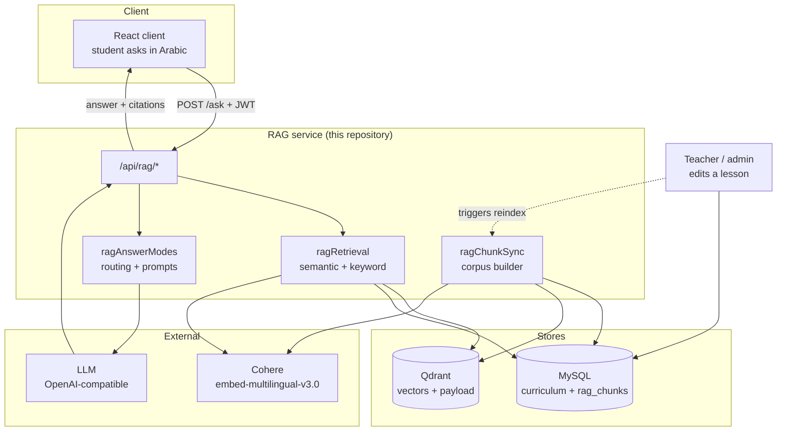
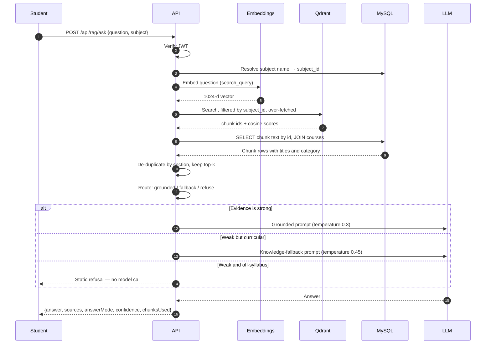
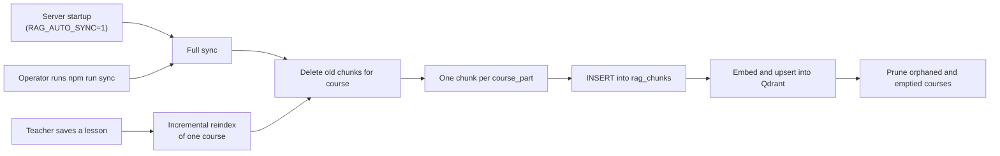
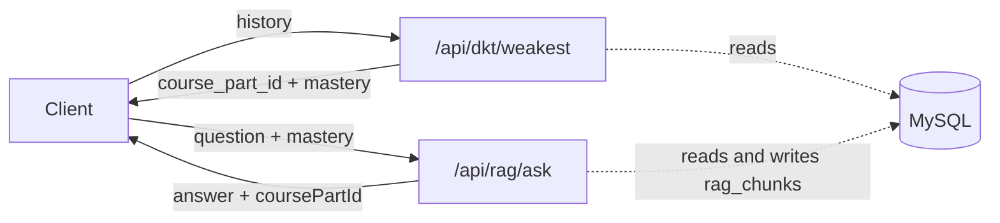

# Architecture

How the platform works, and why it is partitioned the way it is.

## 1. The problem the design answers

DeepBac sells access to a curriculum: lessons written and reviewed by teachers for the Algerian
*baccalauréat*. A student asking "why did the Berlin crisis end in partition?" wants the answer the
syllabus gives, expressed in the vocabulary their examiner expects.

A general language model answers that question fluently and, often, wrongly for this purpose. It
draws on a global corpus, uses terminology from other curricula, and cannot distinguish a fact that
appears in the Algerian syllabus from one that does not. It also cannot be corrected: when a teacher
edits a lesson, nothing about the model changes.

So the platform is built around one constraint: **the curriculum decides what is true, and the model
only decides how it is worded.** Everything below follows from that.

## 2. Components

### MySQL — the system of record

Holds the curriculum (`subjects` → `units` → `courses` → `course_parts`) and the derived retrieval
corpus (`rag_chunks`). Every piece of text a student can be shown originates here. Full schema and
rationale: [DATA_MODEL.md](DATA_MODEL.md).

### Qdrant — the retrieval index

Holds one vector per chunk, with a small payload: subject, course, chunk identifier, and titles.
It deliberately does **not** hold chunk text. A search returns identifiers and scores; the service
then reads the corresponding rows from MySQL.

The cost of this is one extra database round trip per question. What it buys is that the index can
never become a second, divergent source of truth. A drifted index degrades ranking; it cannot
produce a citation to text the curriculum no longer contains.

### The embedding model

Cohere `embed-multilingual-v3.0`, 1024 dimensions, cosine distance. Chosen because the corpus is
Arabic and queries are Arabic, often with dialectal phrasing that never appears in the written
lesson. See [RAG_PIPELINE.md](RAG_PIPELINE.md) for the asymmetric `search_document` /
`search_query` handling this model requires.

### The generator

Any OpenAI-compatible chat-completions endpoint. Two are wired:

- **hosted** (`/api/rag/ask`) — the production path, a large hosted model;
- **local** (`/api/rag/ask-local`) — a self-hosted fine-tuned Arabic model, served by vLLM or a
  comparable runtime.

Both receive the same retrieved context. Holding retrieval byte-for-byte identical is what lets a
comparison between them attribute a difference to the generator rather than to what it was given.

## 3. Request lifecycle

Step 6 is filtered by subject before ranking, not after. A pre-filter on an indexed payload field
means a physics question never competes with history chunks for the top-k slots, and it keeps recall
meaningful as the corpus grows across subjects.

Steps 10 through 12 are the part a reader should look at closely: the answer mode is chosen from
retrieval scores **before** generation, so the prompt the model receives already encodes how much
license it has. This is discussed in [RAG_PIPELINE.md](RAG_PIPELINE.md) §5.

## 4. Indexing lifecycle

The corpus is derived, never authored. Three triggers rebuild it:

Because a rebuild is idempotent and cheap to trigger, `rag_chunks` can be dropped entirely and
restored from the curriculum. That property is what makes chunking strategy an experiment rather
than a migration: changing it means re-running a script, not rewriting data anybody authored.

Startup sync runs in the background, after the port is already accepting connections. A cold full
sync embeds every chunk and can take minutes; blocking the listen call on it would mean a deploy
looked like an outage.

## 5. Failure behaviour

The service degrades in stages rather than failing whole. Each row below is a real code path, not an
aspiration:

| What fails | What happens | What the student sees |
|---|---|---|
| Qdrant unreachable, or the collection is missing | Search returns empty; retrieval falls back to keyword overlap over MySQL | A slightly worse answer |
| Cohere key absent or invalid | Semantic retrieval is never enabled; keyword path only | A slightly worse answer |
| Retrieval returns nothing relevant | Answer-mode routing selects fallback or refusal | A labelled fallback answer, or a refusal |
| Generator quota exhausted (HTTP 402) | `200` with an empty `answer` and an `_error` field | The client degrades to plain chat |
| Generator key missing | `503` at the endpoint | An explicit service error, not a wrong answer |
| MySQL unreachable | Retrieval returns empty; health endpoint reports `DEGRADED` | An error, because no answer can be grounded |

The ordering is deliberate. Every degradation costs answer quality, and none of them silently
converts a grounded answer into an ungrounded one: the `answerMode` field on every response always
states which regime produced it.

## 6. Deployment

The service is stateless. All state lives in MySQL and Qdrant, so instances scale horizontally with
no coordination, with two caveats:

- **Startup sync should run on one instance only.** Several instances rebuilding the same corpus
  concurrently is wasted embedding spend, not corruption, but it is still waste. Set
  `RAG_AUTO_SYNC=0` everywhere except one designated indexer.
- **`TRUST_PROXY_HOPS` must match the real topology.** Rate limiting reads the client address
  through it; too low and the proxy throttles itself, too high and a caller can spoof its address.

The production deployment runs behind a reverse proxy on a single VPS alongside MySQL, with Qdrant
in a container on the same host. Nothing in the code assumes that arrangement.

## 7. Two services

This repository holds the platform's two model-backed services. They answer different questions:

| Service | Runtime | Entry point | Answers |
|---|---|---|---|
| **RAG** | Node.js | `src/server.js`, port 5001 | "What does the lesson say about X?" |
| **DKT** | Python | `dkt/api.py`, port 5002 | "Which lesson should this student revise, and how well do they know it?" |

**What they share.** One MySQL database, one `JWT_SECRET` — so a single student token authenticates
against both — and one key, `course_parts.id`. That last one is the whole reason the pair is worth
more than its halves: the tracer's micro-skill and the retriever's unit of retrieval are the same
authored lesson section, so a weakness prediction names something directly retrievable and a
citation names something directly traceable. No mapping table, no heuristic, no drift.

**What they deliberately do not share.** Neither imports the other and neither calls the other over
HTTP; composition happens in the client (see [API.md](API.md) §Composing with the knowledge tracer).
That is what keeps the availability of the pair equal to the availability of whichever one the
student is currently using, rather than to the product of the two. A student can read a grounded
explanation while the tracer is down, and see their weak sections while the generator's quota is
spent.

The one place the tracer's output reaches the RAG service is the optional `mastery` field on
`/api/rag/ask`, which the client passes along. It changes a prompt paragraph and nothing else: no
extra model call, no effect on retrieval, and no effect at all when it is absent.

## 8. Boundaries of this repository

Present: retrieval, indexing, answer-mode routing, prompt construction, generation, the evaluation
harness, knowledge tracing and its training pipeline.

Absent, because it belongs to the wider platform: user accounts and registration, subscriptions and
payments, exercises and the AI grader that scores them, progress dashboards, the React client. Both
services verify tokens issued elsewhere and read a database the platform also writes; they own
neither. The DKT service in particular creates no tables — it reads `exercise_qa` and
`smart_review_qa`, and writes nothing back.
