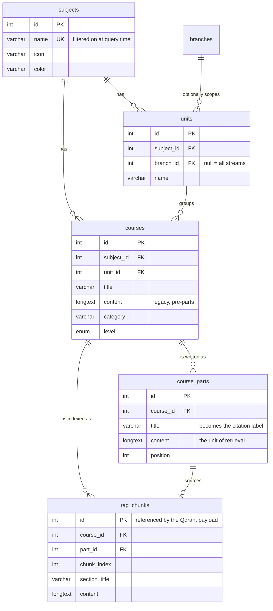
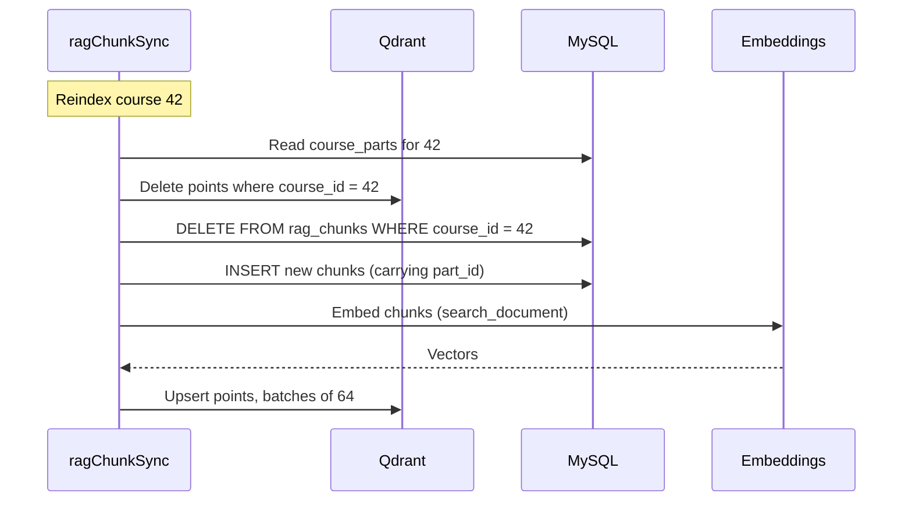

# Data model

Two stores, one of which is authoritative. Everything here follows from that asymmetry.

## 1. Why two stores

A single store would be simpler. Qdrant can hold chunk text in its payload; MySQL 8 can do full-text
search. The split exists because the two jobs have different correctness requirements:

- The curriculum must be **exact and current**. A teacher's edit has to be what the next student
  sees, and a deleted lesson has to stop being quoted.
- The index must be **fast and approximate**. It ranks candidates; it is allowed to be slightly
  stale, and it is rebuilt routinely.

Putting text in the index merges those requirements, and the strict one loses. The rule this schema
enforces is therefore: **Qdrant stores vectors and pointers; MySQL stores every byte a student can
be shown.**

The concrete payoff: a stale index ranks badly, but it cannot cause a citation to text the
curriculum no longer contains — because the text is always read from MySQL at answer time.

## 2. MySQL



### Authored tables

`subjects` → `units` → `courses` → `course_parts` are written by teachers and administrators through
the platform's admin interface. This service only reads them.

`subjects.name` is unique, because retrieval resolves a subject by the name the client sends. A
duplicate name would silently address the wrong corpus — the query would succeed and return
confident answers from the wrong subject.

`units.branch_id` is nullable: a unit either belongs to one academic stream (*شعبة*) or applies to
all of them. `courses.content` is a pre-migration single-blob lesson body, still read as a fallback
so old lessons stay retrievable without forcing a content migration.

### The derived table

`rag_chunks` is machine-generated, never hand-edited, and safe to drop: `npm run sync` rebuilds it
from `course_parts`. Under the strategy in [RAG_PIPELINE.md](RAG_PIPELINE.md) §1 the mapping is one
row per non-empty part, so `chunk_index` equals the part's ordinal position.

| Column | Role |
|---|---|
| `id` | Referenced by the Qdrant payload as `chunk_db_id`; the join key at answer time |
| `course_id` | Provenance; `ON DELETE CASCADE` removes chunks when a course is deleted |
| `part_id` | The authored section this chunk came from — and the knowledge tracer's micro-skill key |
| `chunk_index` | Ordinal within the course; combines with `course_id` into the Qdrant point id |
| `section_title` | The label shown to the student as a citation |
| `content` | The authoritative text placed in the prompt |

`chunk_index` is the chunk's rank among the course's **non-empty** parts, ordered by
`course_parts.position` then `id`. It is not a copy of `position`: a part left empty by its author
is skipped, so the two diverge as soon as a lesson has a placeholder section.

### `part_id`, and why it is the load-bearing column

`part_id` is what makes the platform's two model-backed services one product. The knowledge tracer
in [DKT_ARCHITECTURE.md](DKT_ARCHITECTURE.md) traces mastery per `course_parts.id`, and retrieval
stores that same id on every chunk. A prediction that a learner is weak on section 149 therefore
resolves to retrievable text through a join, with no mapping table and no heuristic in between —
and the reverse direction works too: every citation returned by `POST /api/rag/ask` carries the
`coursePartId` a client sends back to the tracer.

Only the legacy fallback path stores `null`, because a single-blob `courses.content` lesson has no
authored sections to point at.

**What the unique key does and does not do.** `UNIQUE KEY unique_chunk (course_id, part_id,
chunk_index)` makes a re-sync idempotent for part-backed chunks and keeps derived Qdrant point ids
collision-free. It does *not* constrain the legacy rows: InnoDB treats each `null` as distinct, so
a unique index containing one never rejects a duplicate. Those rows are kept unique by the
`DELETE FROM rag_chunks WHERE course_id = ?` that precedes every insert, which is the mechanism that
actually guarantees idempotency on both paths. The constraint is a second line of defence, not the
first.

### Character set

`utf8mb4` throughout, and the reason is narrower than it is usually stated. Ordinary Arabic —
letters, diacritics, and the presentation forms a PDF extractor emits — sits inside the Basic
Multilingual Plane and encodes in three bytes, so MySQL's legacy `utf8` alias would carry it
unharmed. What it would not carry is everything else that reaches a student-facing text column:
emoji in a typed question, and the Arabic Mathematical Alphabetic Symbols block (U+1EE00–U+1EEFF)
that appears in transcribed formulas. On a three-byte column MySQL rejects or truncates those rather
than storing them, and a truncation inside curriculum content is irreversible. `utf8mb4` costs
nothing here and removes the category of failure entirely.

### Two operational scars worth keeping

Both are defended in `services/ragChunkSync.js`, and both cost real debugging time:

- **`id <= 0` rows.** Legacy SQL dumps restored rows with `id = 0`, which then collided with the
  next `AUTO_INCREMENT` insert. `pruneInvalidRagChunkIds` deletes them before every sync.
- **Explicit id assignment.** Chunk ids are computed as `MAX(id) + 1` and inserted explicitly,
  then `AUTO_INCREMENT` is realigned — because a restored dump can leave the counter behind the
  data.

### The rest of the schema

Two more tables exist in [../sql/schema.sql](../sql/schema.sql) and are not part of retrieval:
`ai_chat_sessions` and `ai_chat_messages` store conversation history when the service is deployed
behind the chat interface. Nothing in the RAG pipeline reads them — an answer is a pure function of
the question and the corpus — so they are listed here only so the schema file has no unexplained
contents.

The knowledge tracer reads two further tables, `exercise_qa` and `smart_review_qa`, which belong to
the wider platform and are **not** created by this repository's schema. It writes to neither. Their
shape and the export view over them are in [../sql/dkt_interactions.sql](../sql/dkt_interactions.sql).
The column that matters here is `exercise_qa.part_id`: it is the same `course_parts.id` that
`rag_chunks.part_id` now stores, which is what makes a mastery estimate and a retrievable chunk two
views of one row.

## 3. Qdrant

One collection, configured at first use:

| Property | Value |
|---|---|
| Collection | `bac_rag_chunks` (`RAG_QDRANT_COLLECTION`) |
| Vector size | 1024 (`RAG_EMBEDDING_DIMENSIONS`) |
| Distance | Cosine |

### Point id

Derived arithmetically rather than stored, so indexing needs no lookup table:

```
point_id = course_id × 1_000_000 + chunk_index
```

Re-indexing a course overwrites exactly that course's points. The code asserts `chunk_index` stays
below the space and that the product is a safe integer; silent wrapping would let one course's
chunks overwrite another's, surfacing much later as inexplicable citations.

### Payload

```json
{
  "subject_id": 1,
  "course_id": 42,
  "chunk_db_id": 1337,
  "course_part_id": 149,
  "chunk_index": 3,
  "section_title": "مظاهر الصراع بين المعسكرين",
  "course_title": "الدرس الأول: تطور العالم في ظل الثنائية القطبية"
}
```

- `subject_id` — the pre-filter, applied inside the search so top-k is computed within the right
  corpus.
- `chunk_db_id` — the pointer back to MySQL. This is the field that makes MySQL authoritative.
- `course_part_id` — the knowledge tracer's micro-skill, duplicated here so that "revise section
  149" can be filtered for *inside* the vector search rather than retrieved broadly and filtered
  after. `null` on legacy chunks.
- The titles are duplicated into the payload only for debugging and logging; answers use the values
  read back from MySQL.

Note what is absent: **chunk text**. That omission is the design.

### Authentication

Qdrant Cloud issues two shapes of key. Classic keys go in an `api-key` header; granular database
keys are JWTs and are sent as `Authorization: Bearer`. The client detects the JWT form by its `eyJ`
prefix, and `QDRANT_USE_API_KEY_HEADER` / `QDRANT_USE_BEARER_AUTH` force either. A 403 here is
indistinguishable from a wrong URL, so `formatSemanticAccessError` prints the host, port and chosen
auth mode — never the key.

## 4. Keeping the two stores consistent

Consistency is maintained by rebuilding, not by transactions. There is no distributed transaction
between MySQL and Qdrant, and none is attempted.



The new content is read before anything is deleted, so a course whose parts cannot be read is never
half-removed from an index it is still present in.

**Vectors are deleted first and written last.** If the process dies mid-way, the index is missing
points that exist in MySQL. That direction of inconsistency loses recall — some lessons are
temporarily unfindable by semantic search, and the keyword path still finds them. The opposite
order would leave points whose `chunk_db_id` no longer resolves, which is the failure that produces
empty or mismatched citations.

A full sync additionally prunes two classes of stale data: chunks whose course no longer exists, and
chunks for courses that have been emptied of content. Both are removed from Qdrant before MySQL,
for the same reason.

**Partial-failure recovery:** `npm run backfill` re-embeds and re-upserts every existing
`rag_chunks` row. Because point ids are derived, it is safe to run repeatedly and at any time.

## 5. Sizing

Per chunk, roughly:

| Store | Cost |
|---|---|
| MySQL | The chunk text itself, duplicated from `course_parts` |
| Qdrant | 1024 floats ≈ 4 KB, plus a payload under 1 KB |

The text duplication between `course_parts` and `rag_chunks` is intentional. The retrieval corpus is
a snapshot that can be rebuilt on a different chunking strategy without touching authored content —
which is precisely what makes chunking an experiment rather than a migration.

A 10,000-chunk corpus is on the order of 50 MB of vectors. This is small; the operational
constraints in practice are embedding API spend during a full re-index, and MySQL text storage.
