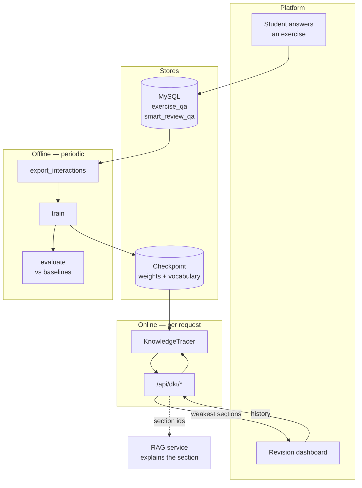
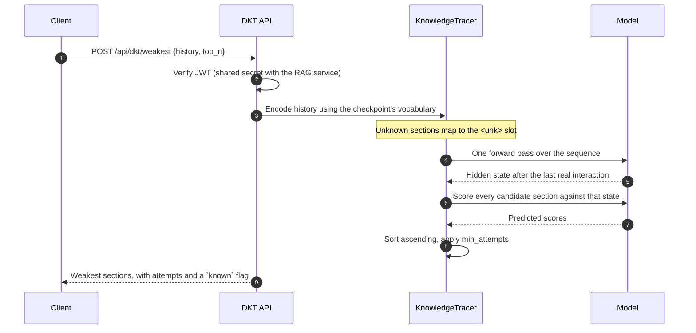

# DKT architecture

How knowledge tracing fits into the platform, and why it is built this way.

## 1. The problem

The RAG service answers what a student asks. It cannot tell them what to ask
about. A student a month before the *baccalauréat* has a limited number of study
hours and a hundred lesson sections; the question that decides their result is
which sections to spend those hours on.

A running average answers that badly. It reports where the student *has been*
weak, treats every section as equally hard, and cannot distinguish a section
that was never solid from one that has decayed since it was last practised.

Knowledge tracing models the trajectory instead: it estimates a latent state
from the sequence of a learner's answers and predicts how they would perform on
a section *now*.

## 2. Where the model sits



The split between offline and online is the main structural decision. Training
is a batch job measured in minutes and run on a schedule. Inference is a single
forward pass over one learner's history, measured in milliseconds, with no
database access at all when the caller supplies the history.

## 3. The unit of knowledge is the lesson section

The micro-skill is `course_part_id` — one authored section of a lesson.

This is the same unit the RAG backend chunks and retrieves over, and the shared
identifier is what connects the two services. A prediction that section 149 is
weak is directly actionable: the platform can open that section, or ask the RAG
service to explain it, without any mapping layer between a "skill" and content.

The alternative — deriving skills by clustering exercises or tagging concepts —
would produce units that no lesson corresponds to, and every recommendation
would then need translating back into something a student can open.

## 4. Why a continuous target

Classical DKT (Piech et al., 2015) predicts *correct* or *incorrect* and trains
with binary cross-entropy. This platform's AI grader returns a score from 0 to
100, with partial credit.

Binarising that score before training throws away the distinction between a
near-miss and a blank answer — which is precisely the distinction a revision
recommendation rests on. A student scoring 55 on a section needs different
advice from one scoring 0. So the target is the normalised score in [0, 1] and
the loss is mean squared error.

The cost is comparability: the knowledge-tracing literature reports AUC on a
binary target. `evaluate.py` therefore also reports AUC over a binarised version
of both prediction and target, for that comparison only. The model is trained
and served as a regressor.

## 5. Request lifecycle



Step 3 is where a subtle failure is prevented. The history is encoded with the
vocabulary *stored in the checkpoint*, never with a mapping re-derived from
current data. Skill indices depend on which sections existed when training ran;
re-deriving them would silently address the wrong embeddings and produce
confident, meaningless predictions.

Step 5 uses the state after the last *real* interaction, gathered by sequence
length rather than by taking the final column of the padded tensor. In a batch
of mixed lengths those are different positions.

## 6. Statelessness

`KnowledgeTracer` holds no per-learner state. Each request carries its own
history. Three consequences:

- Instances scale horizontally with no coordination.
- A student's newest answer is reflected on the next request, with no cache to
  invalidate.
- The service can answer for a learner whose data is not in its database at all,
  which is what makes the inline endpoints usable from a client that assembles
  the history itself.

The cost is bandwidth: a long history is re-sent on every call. For the
sequence lengths involved — tens to a few hundred interactions — that is far
cheaper than the cache-invalidation logic it replaces.

## 7. Failure behaviour

| What fails | What happens |
|---|---|
| No checkpoint on disk | `503` from the prediction endpoints; `/api/health` reports `DEGRADED` and names the missing file |
| Checkpoint corrupt or incompatible | `503` with the load error; the process keeps running |
| Section unseen during training | Prediction proceeds via the `<unk>` slot; the response marks it `known: false` |
| History empty | `422` from request validation — the model has nothing to condition on |
| MySQL unreachable | Only the history endpoint fails; inline prediction is unaffected |

The model is loaded lazily on first use rather than at import. A missing
checkpoint then produces a readable health response instead of a container that
crash-loops before anyone can read the error.

## 8. Retraining

Nothing retrains automatically. Training is a deliberate, scheduled act:

```bash
python -m dkt.scripts.export_interactions --out data/interactions.csv
python -m dkt.train --csv data/interactions.csv
python -m dkt.evaluate --csv data/interactions.csv
```

The evaluation step is not optional. A new checkpoint that fails to beat the
per-section-average baseline should not be deployed, and that comparison is the
only thing that detects it. See [DKT_EVALUATION.md](DKT_EVALUATION.md) §3 for a
case where exactly that happened.

Deployment is a file copy plus a restart. Because the vocabulary travels inside
the checkpoint, a new model can index different sections from the old one
without any coordinated change elsewhere.

## 9. How it composes with the RAG service

The two services share a database, a JWT secret, and the `course_part_id` key.
They do not call each other; the client composes them:

1. `POST /api/dkt/weakest` returns the sections to revise, each with a predicted
   mastery score.
2. The client shows those sections, and offers to explain each one.
3. `POST /api/rag/ask` answers questions about the section, grounded in it —
   and, when the client passes the predicted score as `mastery`, pitched at the
   level the tracer estimated.

That third step is the only place a prediction reaches the generator, and it
reaches it as one paragraph in a prompt that was being assembled anyway: no
second model call, no effect on retrieval, and no effect at all when the field
is absent. [RAG_PIPELINE.md](RAG_PIPELINE.md) §6a describes the three
tiers and their boundaries; [DKT_API.md](DKT_API.md) and [API.md](API.md) give
the two requests side by side.

Keeping the composition in the client rather than server-to-server means either
service can be deployed, scaled or taken down alone, and neither becomes a
dependency of the other's availability. A student can read a grounded
explanation while the tracer is down, and see their weak sections while the
generator's quota is spent.
