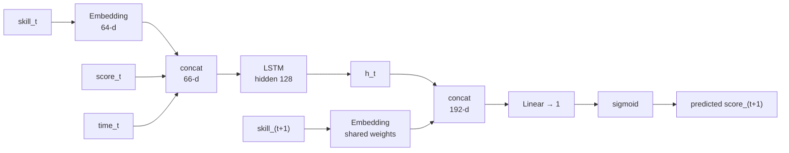

# The model

Inputs, architecture, training, and the details that are easy to get wrong.

## 1. Shape of the problem

A learner is a sequence of interactions, oldest first:

```
(skill_1, score_1, time_1), (skill_2, score_2, time_2), …, (skill_T, score_T, time_T)
```

At each step the model predicts the *next* score. A sequence of length `T`
yields `T - 1` supervised positions.

| Symbol | Meaning | Encoding |
|---|---|---|
| `skill_t` | The lesson section practised | Embedding index, 0 … num_skills |
| `score_t` | Awarded score | Divided by the score scale, clipped to [0, 1] |
| `time_t` | Time to answer | Min-max over training seconds, clipped to [0, 1] |

Response time is an **input**, never a target. A fast wrong answer and a slow
wrong answer are different evidence about mastery — the first suggests a
misconception confidently held, the second an attempt that ran out of ideas —
and the LSTM is free to use that difference.

## 2. Architecture



In one line:

```
score_hat(t+1) = sigmoid( W · [ h_t ; embed(skill_{t+1}) ] )
```

**Why condition on the next skill.** Plain DKT outputs a vector over all skills
and reads off the entry for whichever comes next. Concatenating the next skill's
embedding instead does the same job with a single output unit, and it turns the
model into something the platform can query directly: *how will this learner do
on this specific section?* That is the question a revision recommendation needs
answered, and it is asked over a list of candidate sections in one forward pass.

**The embedding table is shared** between the history encoder and the
conditioning head. A section means the same thing whether it is being read from
the past or asked about for the future, and sharing halves the parameters that
have to be learned per section — which matters when a section has been attempted
only a handful of times.

Default sizes: embedding 64, hidden 128, one layer, no dropout. All configurable
through the environment or command-line flags.

## 3. Loss

Masked mean squared error over valid next-step positions:

```python
diff = (pred - target) ** 2 * mask.float()
loss = diff.sum() / mask.float().sum().clamp_min(1.0)
```

Normalising by the number of *real* positions rather than the tensor size keeps
the loss comparable across batches with different amounts of padding. Dividing
by the tensor size makes a batch of short sequences look artificially good, and
the training curve then reports the batch composition rather than the model.

MAE is computed alongside and reported, never optimised. It reads directly: an
MAE of 0.22 means the typical prediction is about 22 score-points off.

## 4. Three details that silently break the model

### Padding must not reach the recurrence

Sequences in a batch have different lengths and are right-padded with zeros —
and `0` is a valid skill index. If the padded tail entered the LSTM, the final
hidden state would depend on how long the *longest* sequence in the batch
happened to be.

`pack_padded_sequence` prevents it. Padding then influences neither the hidden
state nor, through the loss mask, the gradient.

### The last state is not the last column

With mixed lengths, `lstm_out[:, -1]` is the last *column* of the padded tensor,
which for any shorter sequence is padding. Inference gathers by length instead:

```python
idx = (lengths - 1).clamp(min=0).view(-1, 1, 1).expand(-1, 1, lstm_out.size(-1))
h_last = lstm_out.gather(1, idx).squeeze(1)
```

### The vocabulary is part of the model

Skill indices are assigned by sorting the section ids present in the training
data. Retrain on a different export and the same section gets a different index.
Weights saved without that mapping are not a model; they are numbers addressed
by the wrong keys.

So the checkpoint stores the mapping, the time-normalisation range, and the
score scale alongside the weights, and inference rebuilds the transform from
them. Re-deriving normalisation from live data would shift the input
distribution under a model that cannot know it moved.

## 5. Splitting, and the leak that is easy to introduce

The split is three-way and holds out **users**, not rows — 80% train, 10%
validation, 10% test by default:

```python
user_ids = list(df["user_id"].unique())
random.Random(seed).shuffle(user_ids)
train_users = set(user_ids[:n_train])
val_users   = set(user_ids[n_train : n_train + n_val])
# everything else is test
```

Splitting by row would put a learner's later interactions in training and their
earlier ones in validation, so the model would predict a student's past from
their own future. That is the standard way to report a knowledge-tracing result
that cannot be reproduced in production.

Validation and test are separate for a second, smaller reason that matters once
numbers are quoted outside the project. Validation chooses the epoch, through
early stopping, and the learning-rate schedule. A number read off the same split
that selected the checkpoint is therefore mildly optimistic. `train.py` scores
the test split exactly once, after the epoch is fixed, and that is the number
[DKT_EVALUATION.md](DKT_EVALUATION.md) reports.

The time scaler is fitted on training users only, for the same reason.

## 6. Sequence windows

Learners with more than `max_seq_len` interactions are cut into consecutive
windows rather than truncated. Truncation would discard the most recent
interactions — the ones every mastery estimate depends on. Windows of length 1
are dropped, since they yield no `(t, t+1)` pair.

## 7. Unknown sections

Index `num_skills - 1` is reserved for a section never seen in training.
Inference meets these constantly: a student opens a lesson authored after the
last training run.

All unknown sections share one embedding, so they all receive the same
prediction — the model's prior for a learner in this state, with no item-specific
information. That is the honest answer, and responses mark it with
`known: false` so a client can label or suppress it.

## 8. Training loop

| Element | Setting | Why |
|---|---|---|
| Optimiser | Adam, lr 1e-3 | Standard for this size; no tuning performed |
| Gradient clipping | Norm 5.0 | LSTMs on long sequences produce occasional huge gradients; one pathological batch would otherwise destroy a converged model |
| Scheduler | `ReduceLROnPlateau`, factor 0.5, patience 2 | Halves the rate when validation stalls |
| Early stopping | Patience 5 on validation MSE | These models overfit small cohorts within a few epochs |
| Checkpoint | Best validation epoch, weights moved to CPU | The best epoch is rarely the last; CPU tensors load on a machine without a GPU |

## 9. Complexity

| | Cost |
|---|---|
| Parameters | `num_skills × 64` + LSTM(66 → 128) ≈ 100k + `64 × num_skills` |
| Training | O(interactions) per epoch; minutes on CPU for tens of thousands of rows |
| Inference | One forward pass over the history, plus one matrix multiply per candidate section |

For a corpus of a few hundred sections this is a small model. It trains on a
laptop CPU, and the practical constraint is data volume, not compute.

## 10. What is deliberately absent

- **Forgetting.** Elapsed time between interactions is not modelled, only the
  time taken to answer. A section practised yesterday and one practised in
  September are treated alike, which is wrong for revision.
- **Item difficulty as an explicit parameter.** It has to be learned inside the
  embeddings rather than being a named quantity that could be inspected.
- **Attention.** SAKT- and AKT-style models outperform LSTM DKT on public
  benchmarks. An LSTM was chosen because it trains stably on a few thousand
  interactions, which is the regime this platform is actually in.
- **Uncertainty.** A prediction from three attempts and one from fifty are
  reported identically. `attempts` is returned so a client can weigh them, but
  the model itself offers no confidence interval.
