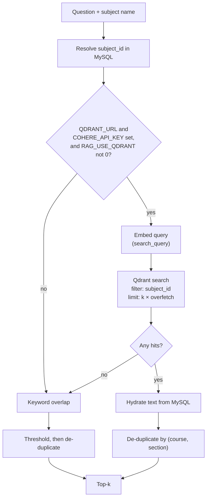
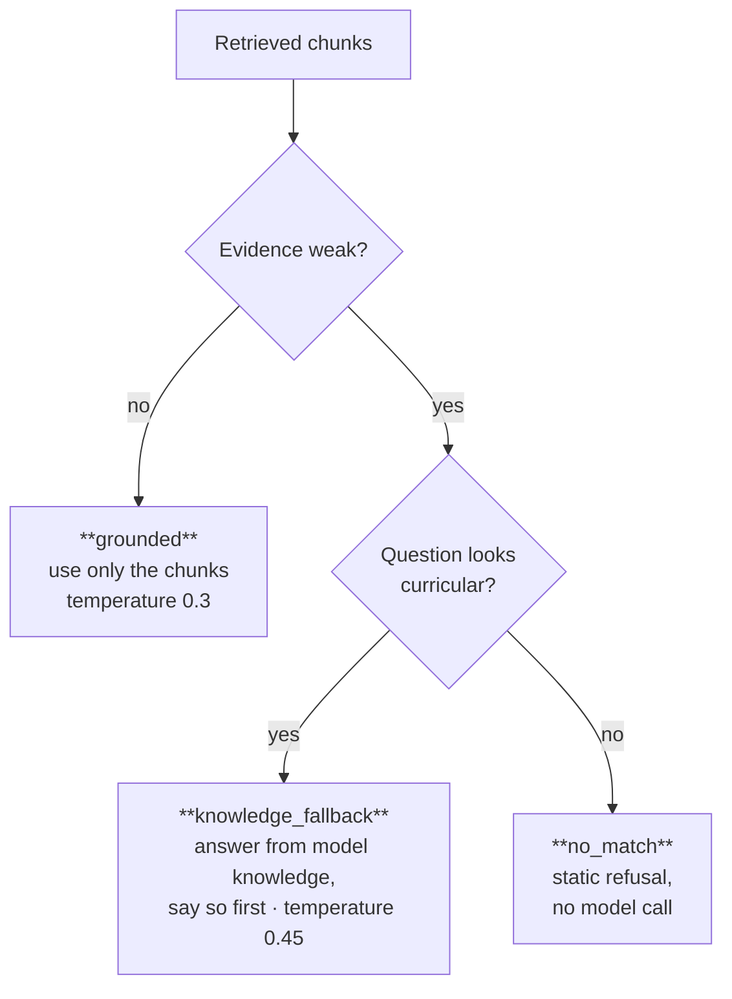

# The RAG pipeline

Indexing, retrieval, routing and prompting — with the reasoning behind each choice.

## 1. Chunking on authored boundaries

Chunks follow the curriculum's own structure: one chunk per `course_parts` row. A part is an
authored section of a lesson, written by a teacher, with its own title — the same unit the
knowledge tracer treats as a micro-skill.

```js
// services/ragChunkSync.js — buildChunksForCourse
parts.map((p, i) => ({
  sectionTitle: (p.title || `جزء ${i + 1}`).trim().substring(0, 200),
  content: (p.content || '').trim(),
  chunkIndex: i
}))
```

Three properties follow from that choice:

1. **The boundary already encodes meaning.** A teacher splits a lesson where the topic changes. A
   character counter splits it wherever the count runs out, which in Arabic prose routinely lands
   mid-sentence, and in a numbered list of causes routinely separates cause three from causes one
   and two. A retrieved fragment that begins mid-argument is worse evidence than a slightly longer
   one that begins at the heading.
2. **Citations become meaningful to a student.** Every chunk carries its part title, so the answer
   can say *"from lesson X, section Y"* and the student can open exactly that section. With window
   chunks, the citation points at an offset nobody can navigate to.
3. **Overlap stops being necessary.** Overlap exists to repair context destroyed by arbitrary
   cutting. If nothing is cut arbitrarily, the corpus does not need to store every boundary region
   twice.

Authored parts vary in length, and two mechanisms keep that from reaching the prompt. Long chunks
are truncated at prompt-assembly time, capped at 1400 characters in grounded mode and 900 in the
fallback, so one long part cannot consume the whole context budget (see §6). And
`GET /api/rag/stats` reports the length distribution, so the variance is observable rather than
assumed.

A legacy fallback remains: a course with no parts but with a non-empty `courses.content` becomes a
single chunk. This keeps pre-migration lessons retrievable without forcing a content migration.

## 2. Embeddings

| Setting | Value | Why |
|---|---|---|
| Model | `embed-multilingual-v3.0` | Arabic corpus, Arabic queries, including dialect |
| Dimensions | 1024 | The model's native size; must match the collection |
| Distance | Cosine | Length-invariant, which matters given §1's size variance |
| Batch | 32 texts per request | Below the provider cap, few enough to retry cheaply |

**What gets embedded is not just the chunk.** The vector is built from the course title, the section
title, and the body, joined:

```js
// services/qdrantSemantic.js
function embeddingInputForChunk(courseTitle, sectionTitle, content) {
  const t = `${courseTitle || ''}\n${sectionTitle || ''}\n${content || ''}`.trim();
  return t.slice(0, 30000);
}
```

Students phrase questions in the vocabulary of the lesson *title* far more often than in the
vocabulary of its body — "the lesson on bipolarity", not a sentence from inside it. Embedding the
titles alongside the body puts that phrasing into the same vector.

**Documents and queries are embedded differently.** Indexing uses `inputType: 'search_document'`,
querying uses `search_query`. This model is trained asymmetrically, and using one type for both
measurably degrades ranking. It is a one-line detail that is easy to get wrong and silent when
wrong: retrieval still returns results, just worse ones.

**Dimension mismatches fail loudly.** If the provider returns a vector whose length differs from the
configured collection size, indexing throws rather than proceeding. The alternative is a collection
that accepts writes and then answers every query badly, which is far more expensive to diagnose.

## 3. Point identity in Qdrant

Qdrant point ids must be unsigned 64-bit integers or UUIDs; an arbitrary string such as `c1_i0` is
rejected with HTTP 400. Ids are therefore composed arithmetically:

```js
const CHUNK_INDEX_SPACE = 1_000_000;
const id = courseId * CHUNK_INDEX_SPACE + chunkIndex;   // asserted to be a safe integer
```

This makes indexing idempotent without a lookup table: re-indexing course 42 overwrites exactly the
points belonging to course 42. The range assertion is not decorative — silently wrapping would make
one course's chunks overwrite another's, and the damage would only surface as inexplicable
citations weeks later.

## 4. Retrieval: semantic first, keyword as the floor



### Semantic path

- **Filter before ranking.** The subject filter is applied inside the Qdrant query, so top-k is
  computed within the right corpus rather than filtered afterwards.
- **Over-fetch, then collapse.** `RAG_QDRANT_OVERFETCH` (default 4) fetches `4 × k` candidates. Long
  lesson parts produce several near-identical neighbours; collapsing them to one per
  `(course_id, section_title)` and keeping the best-scoring member is what makes top-5 mean five
  distinct sections rather than five views of one.
- **Hydrate from MySQL.** Payloads carry `chunk_db_id`; the text comes from `rag_chunks`.
- **Fail soft.** Any Qdrant error is logged and returns an empty result, which falls through to
  keyword retrieval. A vector-store outage costs answer quality, not availability.

### Keyword path

A deliberately simple lexical overlap, used when semantic search is unconfigured or returns nothing:

- Tokens are Arabic runs of 3+ characters and Latin runs of 4+, minus a stop-word list.
- A token found in the body scores 1; found under a Markdown heading, 3; found in the course or
  section title, 4.
- A match in a *title* outweighs a match in the body, for the same reason titles are embedded in §2.

Two thresholds keep it from answering noise. The best chunk must score at least 2, and surviving
chunks must score at least 42% of the best. Without the relative threshold, a weak top match drags
in four weaker ones and the prompt fills with irrelevant lessons — which reads to a student as the
assistant changing the subject.

**Why keep a lexical retriever at all?** It has no external dependency, no per-query cost, and no
cold start. It is the property that lets the service be deployed and demonstrated before any
embedding key exists, and it is what stands in when a provider has an outage.

### Stop words are not cosmetic

```js
const QUERY_STOPWORDS = new Set(['من','في','على','إلى','عن',/* … */,'اشرح','وضح','درس','الدرس', /* … */]);
```

The list includes pedagogical framing words — *explain*, *clarify*, *lesson* — not only grammatical
particles. Students prefix nearly every question with them, and every chunk in a lesson corpus
contains them. Left in, they retrieve whichever chunk is longest.

## 5. Answer-mode routing

Retrieval quality is judged **before** generation, and it selects one of three prompts.



### Deciding that evidence is weak

The two retrievers score on incompatible scales, and one function reconciles them:

```js
function isChunkEvidenceWeak(chunks) {
  if (!Array.isArray(chunks) || chunks.length === 0) return true;
  const best = chunks[0].score;
  if (typeof best !== 'number' || !Number.isFinite(best)) return false;
  if (best >= 2) return false;                                    // keyword path already filtered
  const t = Number(process.env.RAG_SEMANTIC_WEAK_TOP_SCORE || '0.42');
  return best < t;                                                // cosine in (0,1)
}
```

Only the top hit is examined: if the best chunk is off-topic, the tail is necessarily worse. The
0.42 cosine threshold is empirical for this corpus — below it, top hits were consistently a
different lesson sharing vocabulary with the question.

### Deciding that a question is curricular

A permissive heuristic: explicit BAC and stream keywords, a supplied subject, a long Arabic run, or
simply a question long enough to be a real one. A short list of obvious non-curricular tokens
(`docker`, `npm`, `hello`, …) rejects small talk and developer chatter.

The asymmetry is intentional. A false negative refuses a real student question and is visible
immediately. A false positive only produces an answer that is explicitly labelled as coming from
outside the lessons.

### Why the fallback exists at all

Strictly grounded RAG refuses whenever the corpus is thin. For a student a week before an exam,
"the lessons do not cover this" is a dead end. The fallback answers from model knowledge but is
required to open by saying the platform's lessons did not supply the text, and to flag that details
vary between streams and years. The student is told which regime produced their answer — in the
prose, and in the `answerMode` field.

This is a product judgement, and it is measurable: `src/scripts/export_eval_dataset.js` writes the
question, the retrieved context and the generated answer into one record, which is what lets a judge
score an answer against the exact evidence the model was given.

## 6. Prompt construction

All prompts are Arabic. Instructing an Arabic answer in English measurably increases code-switching
in the output.

**Context is rendered as numbered, attributed source blocks:**

```
[مصدر 1: <course title> - <section title>]
<chunk text, truncated>

---

[مصدر 2: …]
```

Explicit source headers give the model something to cite by name, and the instruction to cite maps
onto text that is actually present in its context.

**Per-chunk truncation protects recall.** Grounded mode caps each chunk at 1400 characters; the
fallback at 900; the local model at 1200. One long part would otherwise consume the budget and
crowd out four other retrieved chunks — recall the retriever earned, discarded at assembly time.

**The grounded system prompt** instructs, in Arabic: use only the supplied context; if the context
does not address the question, say so explicitly rather than guess; do not merge two unrelated
topics; cite lesson and section titles verbatim and attribute nothing to a title absent from the
context; and format mathematics and chemistry as LaTeX (`$…$`, `$$…$$`, `\ce{…}`) because the client
renders it.

**Both prompts carry the examination methodology block** — how to structure a definition, a
cause-and-effect answer, a chronological answer, a literary commentary, a calculation. A grounded
answer that states every correct fact in the wrong shape still loses marks under the official
*corrigés types*, which score the method and not only the result, so the block belongs on the path
that produces most answers and not only on the fallback.

**The fallback system prompt** additionally requires the opening disclosure and restricts scope to
the Algerian syllabus. Weak chunks are still passed, shortened and labelled with their scores, as
optional hints the prompt says may be ignored.

## 6a. Three optional layers: mastery, register, and the guards

Three things sit around the prompt without changing which mode produced it. All three are inert by
default, which is what keeps earlier measurements reproducible: a request that supplies none of them
assembles the unadapted prompt, unchanged.

**Mastery-conditioned difficulty.** `POST /api/rag/ask` accepts an optional `mastery` — a predicted
score for this lesson section, produced by the knowledge tracer in
[DKT_ARCHITECTURE.md](DKT_ARCHITECTURE.md). `services/masterySteering.js` maps it to one of three
tiers and appends the matching paragraph to the system prompt:

| Predicted mastery | Tier | What the prompt asks for |
|---|---|---|
| < 0.50 | foundational | Recall the rule first, one step per line, explain terms, hint-rich exercises |
| 0.50 – 0.80 | standard | Examination format and examination difficulty |
| > 0.80 | challenge | Skip the basics, connect topics, edge cases and where marks are lost |

Two properties make this worth doing at all. It costs **no second model call** — the paragraph joins
a prompt that was being assembled anyway, so an adapted answer and an unadapted one cost the same.
And it is **strictly additive**: the difficulty layer is appended after the grounding rules, so it
can change how an answer is presented and never what it may be drawn from. A struggling learner gets
more scaffolding around the same retrieved facts, never invented ones to fill a gap the corpus left.

The score arrives on either scale — `predicted_normalized` (0–1) or `predicted_score` (0–100) — and
anything unparseable yields no tier rather than a default, because a wrong tier is worse than none.

**Language register.** Retrieval is already multilingual: one embedding space covers Modern Standard
Arabic, French and Algerian Darja, so a Darja question retrieves formal Arabic lessons with no
translation step (§2). Generation is where the registers stop being interchangeable, and
`services/languageRegister.js` classifies the question by script and a small function-word lexicon.
The rule it encodes is not "reply in the language you were given" — Darja is not a written
examination language and an answer in it would be useless for revision. It is: the answer stays in
the language the subject is examined in, and the register decides how much of the student's own
vocabulary is carried along. Detection is biased toward the formal default, so a missed dialect
question is still answered correctly, only in a more formal tone.

**The two guards.** `services/promptGuard.js` screens the question before retrieval for
instruction-override attempts in all three registers, so a question written at the system rather
than at the curriculum costs neither an embedding call nor a generation call. After generation, it
checks every source the answer cited against the titles that were actually retrieved, and reports
the result as `citationCheck`. A citation of a section that was never retrieved is a fabricated
source, and it is exactly the failure a curriculum-grounded product cannot ship: a student who opens
the cited lesson finds nothing there.

A failed citation check is reported and logged, never silently repaired. Editing the model's text
after the fact would hand the student an answer nobody wrote, with no record of what was removed.

## 7. Tuning

| Variable | Default | Effect |
|---|---|---|
| `RAG_TOP_K` | 5 | Chunks in the prompt. Higher improves recall, dilutes attention, costs tokens. |
| `RAG_TOP_K_LOCAL` | 3 | Lower for the self-hosted model's smaller usable context. |
| `RAG_QDRANT_OVERFETCH` | 4 | Candidates per slot before de-duplication. |
| `RAG_QDRANT_SCORE_THRESHOLD` | unset | Hard cosine floor inside the Qdrant query. |
| `RAG_SEMANTIC_WEAK_TOP_SCORE` | 0.42 | Grounded-versus-fallback boundary. The single most consequential knob. |
| `RAG_EMBEDDING_DIMENSIONS` | 1024 | Must match the model and the collection. |
| `RAG_EMBED_BATCH_SIZE` | 32 | Texts per embedding request. |
| `RAG_MASTERY_FOUNDATIONAL_MAX` | 0.50 | Below this, scaffolded answers. Pedagogical, not fitted. |
| `RAG_MASTERY_CHALLENGE_MIN` | 0.80 | Above this, stretch answers. Move only on cohort evidence. |

## 8. Known limitations

- **Lexical fallback is not a hybrid retriever.** It is a fallback, not a fused ranker; there is no
  reciprocal-rank fusion between the two signals. Fusing them is the obvious next step.
- **No re-ranking.** A cross-encoder over the over-fetched candidates would likely improve
  precision at top-5 more than any threshold tuning.
- **No query rewriting.** Pronoun-laden follow-up questions in a chat session retrieve poorly,
  because the embedded query is the message, not the conversation.
- **Chunk size is bounded by authoring.** A teacher who writes one very long part produces one very
  long chunk, and truncation then silently drops its tail.
- **Thresholds are corpus-specific.** 0.42 was tuned on Arabic history and geography. Another
  subject, or another embedding model, needs it re-derived.
